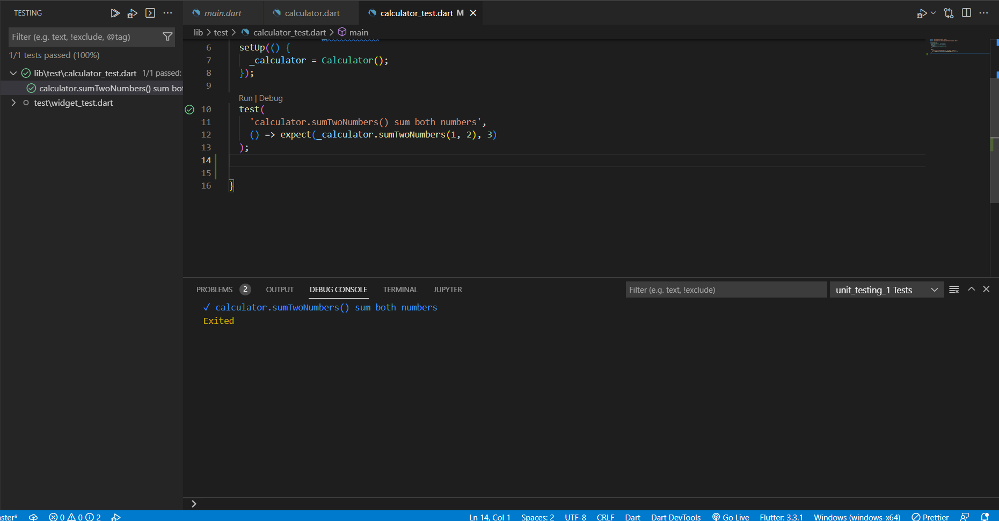

# unit_testing_1

## Praktikum 1

Pada praktikum 1 kita menggunakan package test untuk melakukan testing. Percobaan pertama kita membuat expect yang berbeda dengan result sebenarnya sehingga hasil testing tidak berhasil

Kemudia kita mengubah agar hasil testing berhasil dengan mengubah nilai return dari fungsi SumTwoNumbers yang awalnya 0 menjadi jumlah dari kedua parameter angka yang diinputkan.

## Praktikum 2
Pada percobaan ini kita menerapkan testing grup yang menghasilkan 2 kodisi yaitu 1 sesuai ekpektasi dan 1 tidak sesuai.

Kemudia kita mengubah menjadi 2 kodisi dari testing sesuai ekspektasi.

## Praktikum 3
Pada percobaan ini, kita melakukan Unit Test Mocking Menggunakan Mockito. ada beberapa dependecies yang perlu ditambahkan yaitu: mockito, build runner dan http. Kita melakukan unit testing pada sebuah fungsi dimana digunakan unttuk mengambil data dari web service API. Terdapat 2 kondisi yaitu: 
1. Mengembalikan data berupa Album jika dalam mengambil data dengan panggilan http sukses
2. Melempar sebuah Exception jika dalam mengambil data dengan panggilan http gagal

